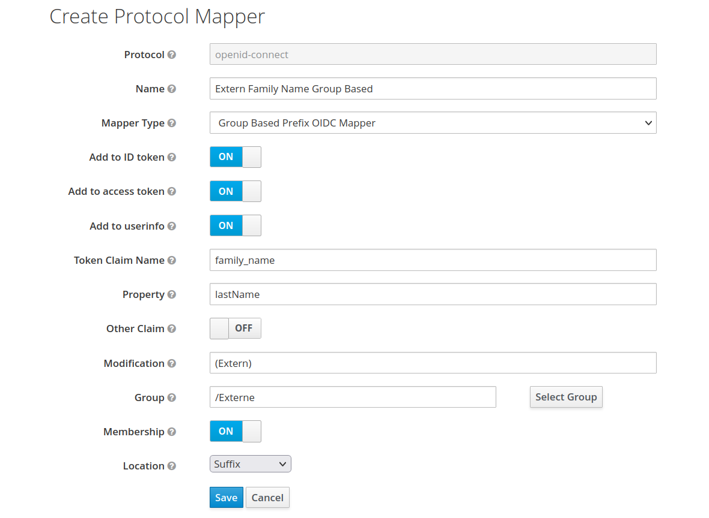

# Keycloak Group Based Prefix Mapper

A Keycloak Mapper that adds a configurable prefix to attributes based on a user's groups.

## Installation

Place the [generated jar-file](https://rechenknecht.net/giz/keycloak/group-based-modification-mapper/-/jobs/artifacts/main/download?job=build-jar) into the Keycloak deployments folder.
In the Keycloak Wildfly distribution it is located at `/opt/jboss/keycloak/standalone/deployments`, while in the Quarkus distribution it is located at `/opt/keycloak/providers`.

## Mapper Configuration

To activate the mapper, you must configure it for your clients.

As an example, we configure the mapper in the following to modify the `family_name` claim by default.
Note that this guide is for the new admin console.

1. Go to the Admin Console under `Client Scopes`.
1. The `family_name` claim is set by default by the `profile` Client Scope. Click `Edit` on the `profile` scope.
1. In the `profile` details view, go to the `Mappers` tab. You should find the existing `family name` mapper there.
1. Click on `Add mapper` and `By configuration` to add the custom mapper. Find the `Group Based Prefix OIDC Mapper` in the list.
1. Configure the mapper as follows. With that configuration, users that are part of the group `Externe` will have the suffix `(extern)` appended to their `lastName` attribute inside the `family_name` claim.

    

Similar to the `family_name` claim, you may add and modify any other claim.
If you want to modify an existing claim in the token, make sure to get the `Claim Name` correct and `Property Name` so that the user's property is properly resolved.
At best, simply copy the configuration from the existing mapper you want to overwrite.
